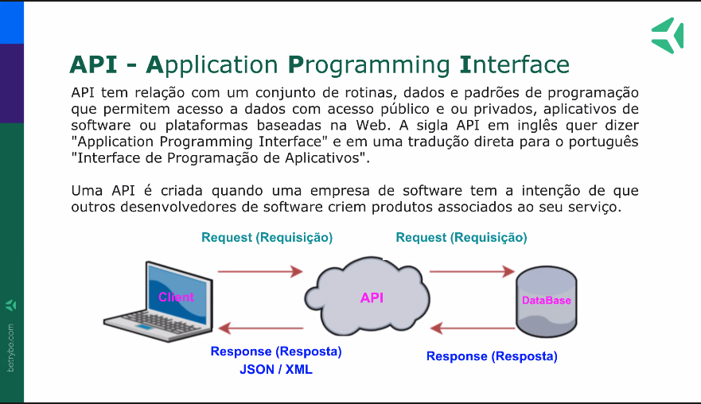
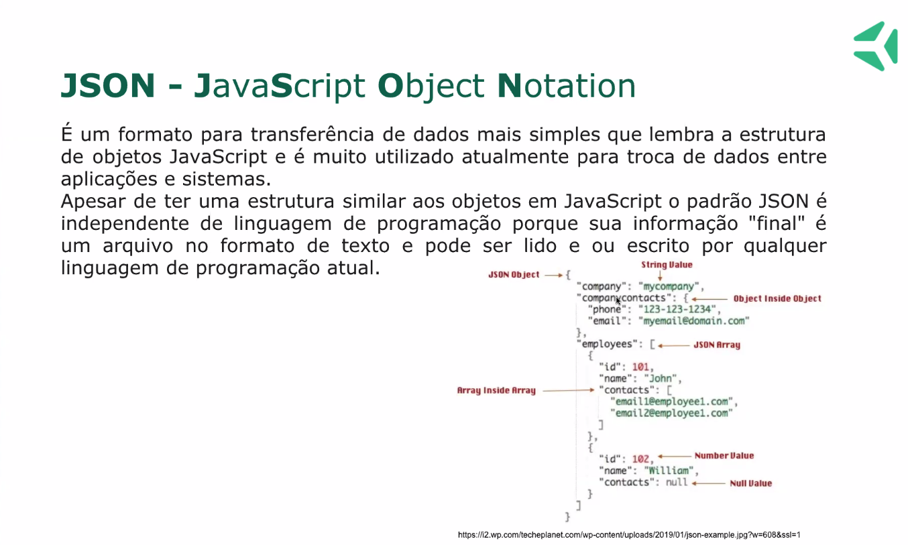

# Fecth API

No contexto do Front-end, a maioria dos casos em que precisamos utilizar funções assíncronas são em requisições. Um bom exemplo é a função fetch() da Fetch API !

A Fetch API contém uma série de recursos desenvolvidos para lidar com requisições http no JavaScript. A função primária é a fetch() , utilizada para fazer chamadas às URL's das APIs . Trata-se de uma função assíncrona, baseada em uma promise.

>Uma API, por sua vez, é uma forma de trafegar dados entre aplicações.

A função `fetch` recebe dois parâmetros:

1- URL do serviço alvo da requisição;

2- Um objeto contendo algumas informações sobre requisição de API. Esse objeto contem chaves com informações específicas para aquela chamada. Essas especificações estão sempre presentes na documentação de uso daquela API específica.

O Retorno da chamada varia conforme a API utilizada, não só em conteúdo, mas também em formato.
No caso do Javascript, lidaremos principalmente com respostas em formato JSON, ou respostas que possam ser reformadas para tal.

>JSON significa: JavaScript Objec Notation.

Ele é um padrão utilizado para troca e armazenamento de dados. Apesar do nome, ele não é um objeto JavaScript, é apenas estruturado de forma que faz uso de chaves e valores.

Por não ser um objeto nativo do JavaScript, precisamos traduzir ele para que fique a par da linguagem que estamos usando, para isso existem duas funções muito utilizadas:

* JSON.parse()
* JSON.stringify()